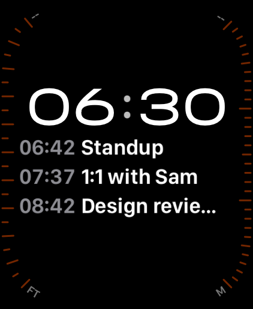
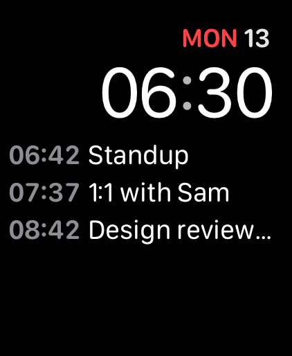
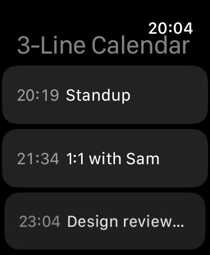
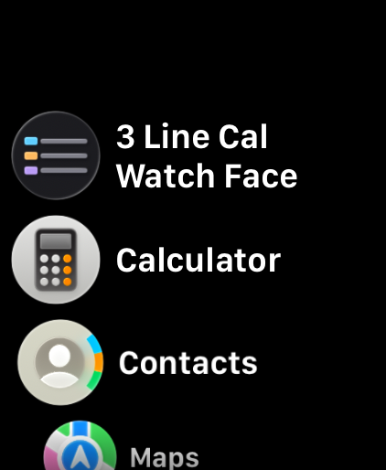

# 3-Line Calendar for Watch Face

**Your next three calendar events, right on your Apple Watch face.**

A clean rectangular complication that shows your next three events of the day — each as
`time · title` — so you always know what's next at a glance, without opening an app.

## Screenshots

<p align="center">
  
  &nbsp;&nbsp;
  
</p>
<p align="center"><em>The “Next 3 Events” complication on built-in watch faces.</em></p>

<p align="center">
  
  &nbsp;&nbsp;
  
</p>

## No BS

I got sick and tired of apps that nag, upsell, and harvest your data. So I built the one I
actually want to use — and I'm giving it away.

- 💯 **Completely free** — no charge, no premium tier, no in-app purchases
- 🚫 **No ads** — ever
- 🕵️ **No tracking, no analytics** — the app makes no network requests to send your data anywhere
- 📅 **Your data stays with you** — calendar events are read on-device via Apple's EventKit and never leave your watch/phone
- 🔓 **Open source** — Apache 2.0; read every line, build it yourself, or fork it

If you like it, please leave a review and share it with friends. That's the whole business model. 🙂

## What it does

- Shows your **next 3 timed events for today** as a watchOS `accessoryRectangular` complication
- Reads your calendar through Apple's Calendar app, so any account you add on iPhone
  (**including Google Calendar**) shows up automatically
- Skips all-day and multi-day events to keep the focus on what's coming
- When today is clear, shows a "next event in Nh" countdown
- Tap the complication to open the app

## Architecture

- **iOS companion** (`iOS/`) — a minimal host app (`im.zzn.apps.threelinecal`)
- **watchOS app** (`Watch/`) — the UI + EventKit access (`…​.watchkitapp`)
- **Complication** (`Complication/`) — the WidgetKit `accessoryRectangular` widget (`…​.watchkitapp.widget`)
- **Shared** (`Shared/`) — the `EventItem` model + App Group (`group.im.zzn.apps.threelinecal`) plumbing

The watch app reads events with EventKit, writes a small snapshot to the App Group, and the
complication renders it.

## Build & run

The Xcode project is generated from `project.yml` with [XcodeGen](https://github.com/yonik/XcodeGen).

```bash
brew install xcodegen
xcodegen generate
open zWatchface.xcodeproj
```

Pick the **ThreeLineCal** scheme and run on a paired iPhone + Apple Watch (or the simulators).
On device: add your calendar in iPhone **Settings → Calendar → Accounts**, open the watch app,
grant calendar access, then add the **Next 3 Events** complication to a rectangular slot on your face.

### Regenerate App Store screenshots

```bash
scripts/make_screenshots.sh        # builds, runs simulators, saves PNGs to screenshots/
scripts/upload_screenshots.py      # uploads them via the App Store Connect API (needs .creds/)
```

## License

[Apache License 2.0](LICENSE) © 2026 Zainan Zhou.
